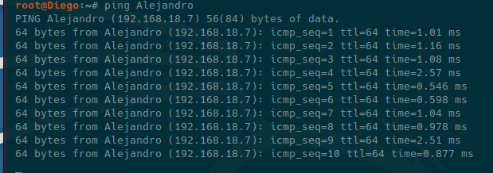

# LOS ARCHIVOS HOSTS Y NSSWITCH.CONF

- Para esta tarea he utilizado una máquina de Kali Linux (Debian)
- Vamos a definir que son los archivos hosts y nsswitch.conf, y cual es su función:

# HOSTS
- El archivo "hosts" es un archivo de un sistema operativo que almacena una lista con los nombres e IPs de los equipos de una máquina local, y este utiliza el sitema de nombres planos.

Aqui podemos un ejemplo de archivo host de Kali Linux, ejecutado con el terminal y pudiendonver una configuración normal con solo 2 usuarios y el localhost.

Y aquí podeis ver que ejecutando el comando ping y el nombre del usuario, nos devuelve en las respuestas la IP de este usuario, ya que esta almacenado en el archivo "hosts", si modificaramos el archivo hosts y cambiaramos la IP de ese usuario, nos devolvería esa IP que hemos cambiado.

# Nsswitch.conf

Archivo donde se encuentra la base de datos de determinados servicios como los archivos: hosts, passwd o LDAP que son los archivos que almacenan los usuarios y contraseñas de usuarios.
- Como podeis en esta captura ver existe una línea para cada servicio en el fichero:

